# 1.接口编程简介

## 1.1 背景

​	随着互联网的发展, 尤其是移动互联为代表的Web3.0时代. 客户端层出不穷, 以APP、微信、PC浏览器为代表, 服务端业务逻辑是基本一致的. 

​	那么有没有一种方式可以做到”**一次编写,随时接入**”呢?

目前比较流行的方案就是"**接口编程**"

 

## 1.2 什么是接口编程

​	一般来说接口编程是基于HTTP协议, <u>通过某个唯一标识符(URI)请求对应的服务器资源(Resource)</u>.

### 1.2.1 什么是URI

在HTTP协议中, URI的组成如下

``` html
Schema://host[:port]/path[?query-string]
```

- Schema: 使用的协议类型, 如http/https/ftp等
- host: 	主机域名或IP
- port: 	端口号(可选)
- path: 	路径
- query-string: 查询参数(可选)

例子:

http://api.local.com/movies

https://api.local.com:8080/articles?id=100

> URI与URL的区别
>
> URI标准, schema支持ftp/ssh等协议类型
>
> URL: schema只能是http

### 1.2.2.什么是资源

- 狭义上讲, 所有在服务器保存的数据(如:音乐/视频/文章/个人信息...)都是服务器端资源.
- 广义上讲, 任何服务器端的对象(如:应用程序/数据库记录/算法...)都可以看作资源.

还是比较不好理解, 咱们举例说明

比如, 我们之前学习过的Jquery+ajax, 就是早期的前后端分离的解决方案

Step1. 创建项目目录

在apache的根目录下创建一个文件夹, 以日期命名, 20181112


Step2. 创建ajax.html

1) 发送ajax请求

2) 将获取的数据渲染到页面

由于使用jquery封装的ajax. 首先得引入jquery

复制到项目目录


引入jquery

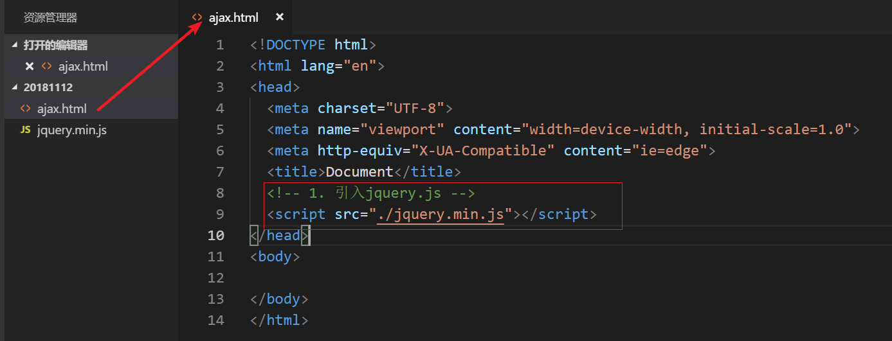

Step3. 使用jquery发送ajax


Step4. 编写test.php

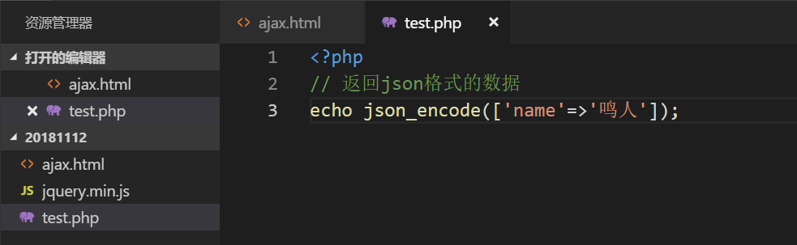

调试


Step5. 渲染页面

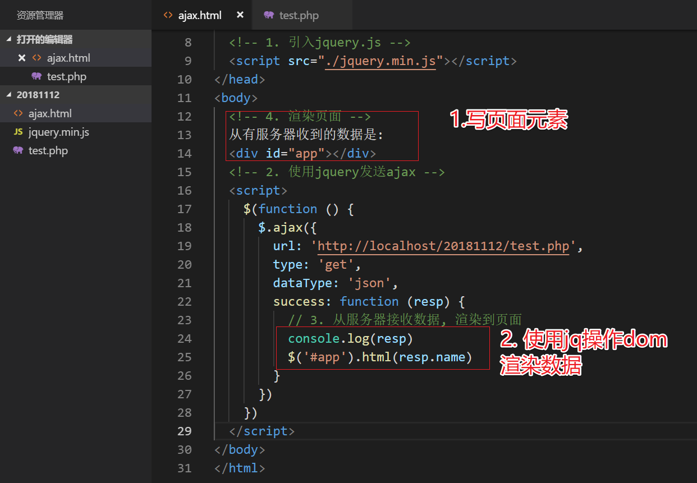

ajax.html

```html
<!DOCTYPE html>
<html lang="en">
<head>
  <meta charset="UTF-8">
  <meta name="viewport" content="width=device-width, initial-scale=1.0">
  <meta http-equiv="X-UA-Compatible" content="ie=edge">
  <title>Document</title>
  <!-- 1. 引入jquery.js -->
  <script src="./jquery.min.js"></script>
</head>
<body>
  <!-- 4. 渲染页面 -->
  从有服务器收到的数据是:
  <div id="app"></div>
  <!-- 2. 使用jquery发送ajax -->
  <script>
    $(function () {
      $.ajax({
        url: 'http://localhost/20181112/test.php',
        type: 'get',
        dataType: 'json',
        success: function (resp) {
          // 3. 从服务器接收数据, 渲染到页面
          console.log(resp)
          $('#app').html(resp.name)
        }
      })
    })
  </script>
</body>
</html>
```

test.php

```php
<?php
// 返回json格式的数据
echo json_encode(['name'=>'鸣人']);
```

在上面这个例子中, 

URI: http://localhost/20181111/test.php

资源: 服务端返回的数据


## 1.3 接口编程的作用

主要是实现了前后端的分离

后端(服务器)为前端(APP端/PC浏览器端/微信端)提供一个简单并且统一的方式(URI), 返回前端需要的数据(Resource).这样不管是APP还是Web浏览器, 只需要通过HTTP协议都可以实现同样的操作. 

# 2.RESTful设计六要素

是不是所有前后端分离的设计都叫RESTful呢? 不是!!!

ful是一个后缀, 意思是"像什么一样的" windful

RESTful是一种软件设计风格, 主要用于有客户端与服务端交互的软件.  主要包括6个方面

- 资源路径(URI)
- HTTP动词(Method)
- 过滤信息(query-string)
- 状态码(Status-code)
- 错误信息(Error)
- 返回结果(Result)

如下图所示:


如果一个软件符合这些约定(风格), 我们就说这个软件是RESTful的

## 2.1 资源路径

标准的RESTful API中, 每个资源路径对应一个**唯一**的资源, 所以规定网址中不能有动词, 只能有名词, 并且一般来说为复数.

比如:

http://api.local.com/movies----表示电影资源

http://api.local.com/images----表示图片资源

http://api.local.com/musics----表示音乐资源

http://api.local.com/articles----表示文章资源

## 2.2 Http动词

对于资源, 一般有4个操作, CURD(增/删/改/查)

GET: 	从服务器获取资源(一项或多项)

POST:	在服务器新建一个资源

PUT:	在服务器更新资源, 服务器返回完整的属性

DELETE:	从服务器删除资源

HEAD:	从服务器获取信息(响应头)

PATCH:	在服务器更新资源, 服务器只返回更新的属性

---

例子: 

POST /articles 	--	创建文章内容

GET /articles/1	--	获取主键id为1的文章

## 2.3 过滤信息(请求数据)

当服务端需要返回的数据很多时, 服务器不可能全部返回

此时, 我们可以在客户端携带过滤信息, 比如: 分页信息

---

例子:

?page=1					--	第一页的信息

?offset=10&per_page=10	--	每页10条, 偏移10

## 2.4 响应状态码

服务端返回的信息, 用来告诉客户端操作结果

| 状态码 | 含义        | 说明                 |
| ------ | ----------- | -------------------- |
| 200    | OK          | 操作成功, 并返回数据 |
| 201    | CREATED     | 新建成功             |
| 204    | NO CONTENT  | 删除成功             |
| 400    | BAD REQUEST | 请求语法错误         |
| 403    | Forbidden   | 请求没有权限的资源   |
| 404    | NOT FOUND   | 没有找到请求的资源   |

## 2.5 错误处理

如果状态码是4xx或者5xx, 需要告诉客户端对应的错误信息. 以Json格式返回

{

“error”: “错误信息”,

}

## 2.6 返回结果

针对不同的操作, 服务需要返回的结果应该符合这样的规范

GET /collections 		--	返回资源列表(数组) 

GET /collections/:id		--	返回单个资源 eg. /collections/1

POST /collections		--	返回新生成的资源

PUT /collections/:id		--	返回资源的完整属性

PATCH /collections/:id	--	返回被修改的属性

DELETE /collections/:id	--	返回204状态码+空文档 

# 3.工具

这里给大家安利一个工具postman. 这个是在接口编程中使用非常多的一个工具

Postman是一个非常好用的免费API测试工具. 主要用于模拟发送Http请求.

官网地址: https://www.getpostman.com/

# 4.前后端分离与接口文档

## 4.1 什么是前后端分离

所谓前后端分离, 如下图所示:

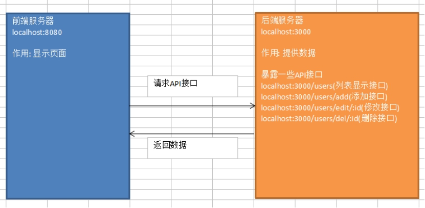 

由上图可知, 一个项目有两个服务器

前端服务器: 显示页面

后端服务器: 提供数据

通过API接口实现前后端的交互!

## 4.2 前后端分离的好处

1. 提高开发效率: 前后端开发人员可是同时开发, 互不影响

2. 提高复用性: 后端通过统一的API提供数据, 这样可以同时为web前端/app前端/微信端提供数据

## 4.3 接口文档

在实战环节, 咱们使用Restful的设计风格, 实现用户模块的CURD

咱们去公司之后, 经常会面临写接口文档的工作, 那么咱们看下接口文档怎么写

见附件: API接口文档.md

前端: vue+axios

后端:json-server

# 5.项目准备

## 5.1 使用npm安装vue

### 5.1.1.安装node

找到软件包中的node-v8.12.0-x64.msi, 双击安装

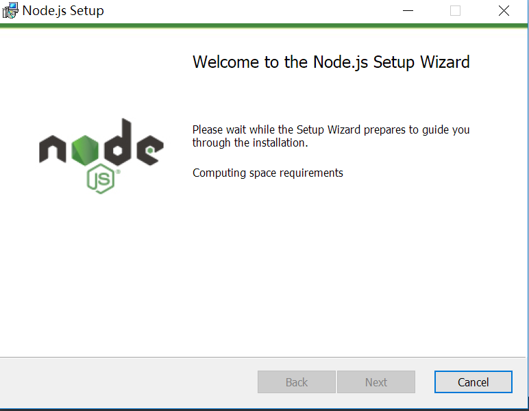

下一步, 到安装完成. 安装完成后, 可以使用如下命令测试

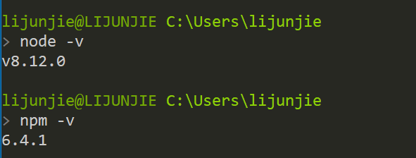

> node是一个js的运行环境, 这里我们安装node主要是需要其中的npm包管理工具

### 5.1.2.配置npm镜像

npm默认的仓库地址是在国外网站，速度较慢，建议大家设置到淘宝镜像。但是切换镜像是比较麻烦的。推荐一款切换镜像的工具：nrm

我们首先安装nrm，这里`-g`代表全局安装

```
npm install nrm -g
```

全局安装后, 会在如下目录, 产生如下文件


然后, 我们就可以使用nrm命令了

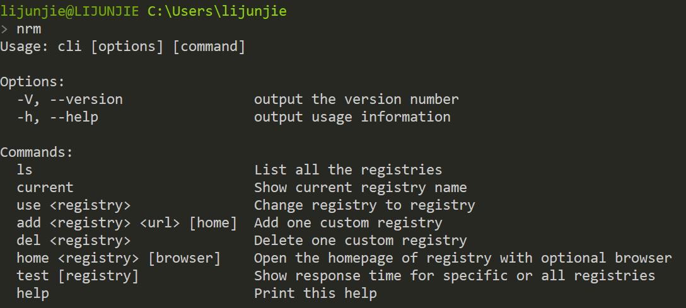

通过`nrm ls`命令查看npm的仓库列表,带*的就是当前选中的镜像仓库：

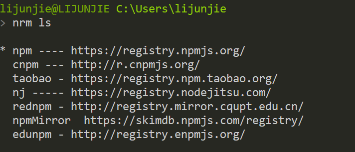

通过`nrm use taobao`来指定要使用的镜像源：

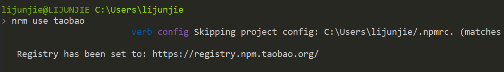

注意：

- 有教程推荐大家使用cnpm命令，但是我使用发现cnpm有时会有bug，不推荐。

### 5.1.3.创建项目

在D盘, 新建一个文件夹code. 打开, 按住shift+鼠标右键, 打开sh窗口


注意: 路径中不要出现中文

### 5.1.4.初始化

使用如下指令初始化

```
npm init -y
```

发现在目录下会多一个文件package.json, 这个文件用来管理该项目使用了哪些包

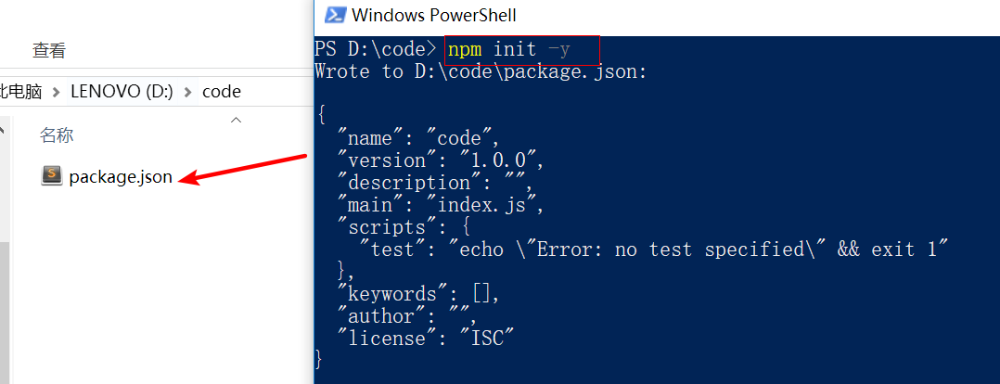

### 5.1.5.安装vue

执行如下命令安装vue

```
npm install vue --save
```

以上命令可以简写为

```
npm i vue -S
```

在项目目录会产生一个文件夹node_modules和一个文件package-lock.json

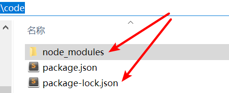

在package.json文件中, 会多如下内容

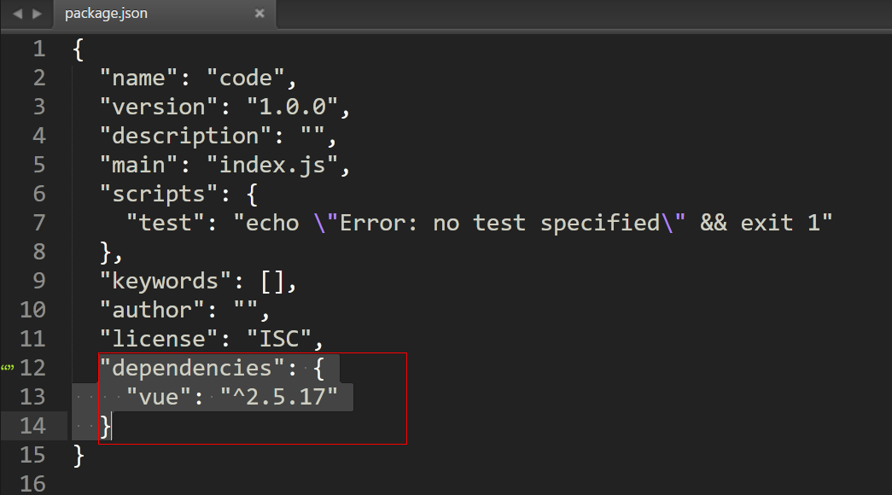

在node_modules里就是vue了


### 小结

总结起来, 使用npm安装一共是两步

1.初初始化:	npm init -y

2.安装		npm install vue --save

## 5.2 使用npm安装json-server

json-server是一个简易的后台服务器, 咱们使用它**模拟API接口服务器**

执行命令

```
npm i json-server -g
```

参数说明:

- i: install的简写
- json-server : 包的名称
- -g: 全局安装

安装完成后, 在C:\Users\Administrator\AppData\Roaming\npm目录下出现

 

表明可以使用全局命令json-server来启动一个API服务器

### 5.2.1.编写数据文件

创建一个db.json 

示例代码:

```json
{
  "users": [
    {
      "id": 1,
      "name": "鸣人",
      "age": 12
    },
    {
      "id": 2,
      "name": "佐助",
      "age": 11
    }
  ]
}
```

### 5.2.2.启动json-server

在vscode中, 使用ctrl+`打开终端, 执行

```
json-server --watch db.json 
```

使用db.json做为数据文件, 提供接口

### 5.2.3.使用postman测试

列表接口:

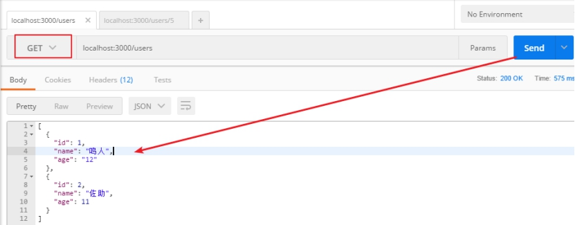 

添加接口:

使用post方式请求, 并且携带添加的数据

返回201, 表示添加成功

 

修改接口:

使用put请求, 在URL地址的后面加上要修改的id, 并携带要修改的数据

返回200, 表示修改成功, 并且返回修改之后的数据

 

删除接口:

使用delete请求, 在URL地址的后面加上要修改的id

返回200, 表示删除成功

 

# 6. Vue-cli初步

## 6.1什么是Vue-cli

从字面上理解: 就是Vue的命令行工具.

官网: https://cli.vuejs.org/zh/guide/

Vue CLI 是一个基于 Vue.js 进行快速开发的完整系统

----

说明: Vue-cli和Vue/cli的区别

- Vue-cli是2.0的版本
- Vue/cli是最新3.0的版本

由于前端项目发展特别快, 在准备这个课程的过程中, Vue cli进行了一次升级, 所以我们在本课程中使用的是2.0的版本. 大致功能区别不大, 学会了以后可以再学习3.0的版本

## 6.2 Vue-cli的作用

基于Vue快速构建一个标准的前端项目

## 6.3 Vue-cli的安装

### 6.3.1.打开命令行窗口

输入如下命令安装

```
npm i vue-cli -g
```

参数说明:

- i: install的简写
- vue-cli : 包的名称
- -g: 全局安装

出现如下效果表明安装完成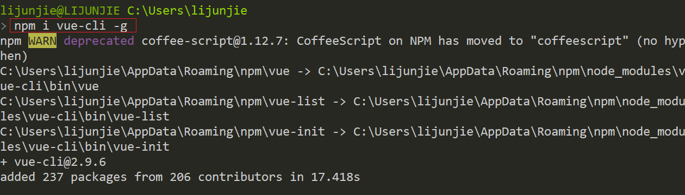

在C:\Users\Administrator\AppData\Roaming\npm目录下, 会多出这样几个文件

 

我们就可以在全局使用vue/vue-init/vue-list这些指令了.

其中, 主要是使用vue指令完成前端项目的生成

### 6.3.2.测试

在全局执行如下命令,

```
vue --version
```

如下图所示

 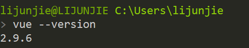

## 6.4 小结

1. vue-cli用来快速构建基本的前端项目

2. 使用npm i vue-cli -g安装vue-cli工具

# 7.vue-cli的使用

## 7.1 创建项目

使用Vue-cli创建前端项目非常简单, 只需要执行一个命令就可以了

### 7.1.1. 打开cmd窗口

在桌面, shift+右键, 打开一个cmd窗口

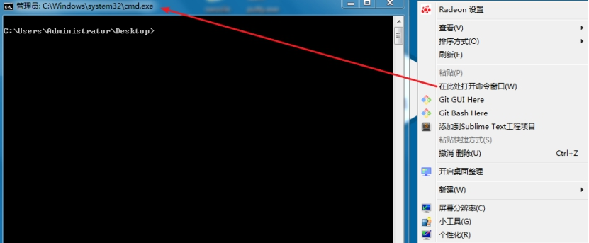 

### 7.1.2. 执行命令

```
vue init webpack first
```

参数说明:

- init: 创建项目
- webpack: 基于webpack模板
- first: 项目名称

 

### 7.1.3. 设置项目名称

接上一步, 在输入命令后, 经过一段时间, 会出现如下提示

设置项目的名称, 询问是否使用”first”做为项目名称, 直接按回车

 

### 7.1.4. 设置项目描述

接上一步, 回车后, 出现如下提示

询问是否使用”A vue.js project”做为项目描述, 可以直接按回车, 或者输入一些描述信息

 

比如: 我们可以输入:”My first vue project”回车

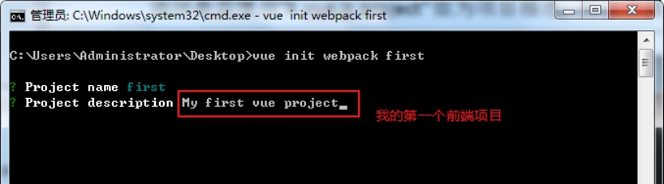 

### 7.1.5. 设置项目作者

接上一步, 回车后, 出现如下提示

 

### 7.1.6. 设置编译项

接上一步, 回车后, 出现如下提示, 直接按回车, 选择默认值

 

在这里, 使用上下按键选择

使用默认值, recommended for most users ---- 推荐大部分用户使用

### 7.1.7. 是否使用vue-router

接上一步, 回车后, 出现如下提示

 

按回车, 选择Y, 使用!!!

### 7.1.8. 是否使用ES语法检测规则

接上一步, 回车后, 出现如下提示

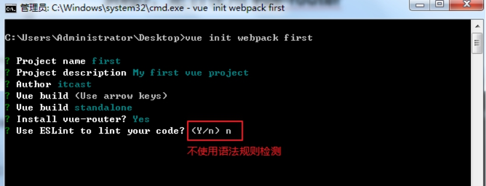 

输入n, 回车. 不使用语法规则检测. 

这里强烈推荐大家在初学的时候, **不使用这个检测!!!** 这个规则非常严格, 特别容易出错

 

### 7.1.9. 是否使用单元测试

接上一步, 回车后, 出现如下提示

 

输入n, 回车, 不使用单元测试

 

### 7.1.10. 是否使用点对点测试

接上一步, 回车后, 出现如下提示

 

输入n, 回车, 不使用点对点测试

 

### 7.1.11. 使用NPM安装所有的依赖包

接上一步, 回车后, 出现如下提示

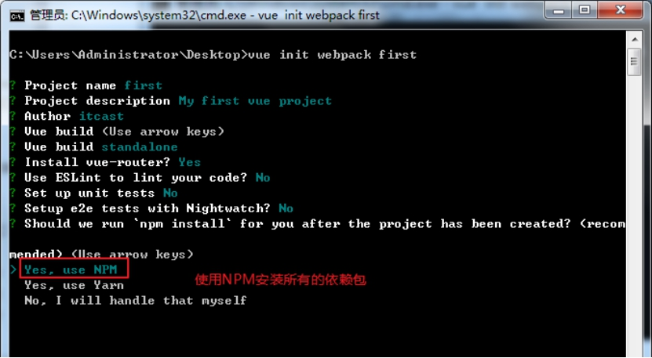 

开始安装

 

安装完成, 出现如下提示

 

### 7.1.12. 测试

进入到first目录

执行命令

 

 

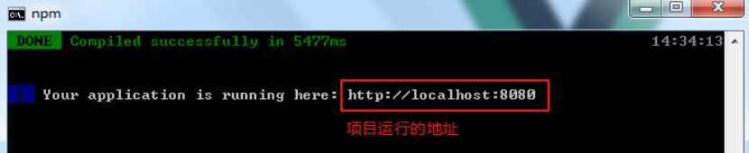 

在浏览器中输入http://localhost:8080, 打开项目

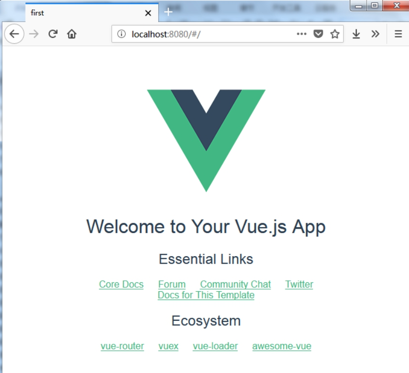 

在cmd命令窗口中, 按ctrl+c, 停止项目

 

输入y 回车, 就可以停止项目	

 

### **小技巧**

1. 在运行项目的同时, 打开浏览器

2. 制作启动命令

--------

1. 修改package.json, 在dev选项后加上--open

 

 

2. 制作一个start.bat文件, 编写如下内容

 

### **提示**

1. 由于要下载比较多的文件, 容易受到网络的影响而失败. 如果失败, 删除目录后重新执行命令

2. 不要关闭cmd命令, 一旦关闭, 项目就停止了

 

## 7.2 目录结构

基于webpack创建的前端项目的目录结构如下:

 

我们主要的工作目录就是src, 其他的文件是跟打包相关的

## 7.3 启动过程分析

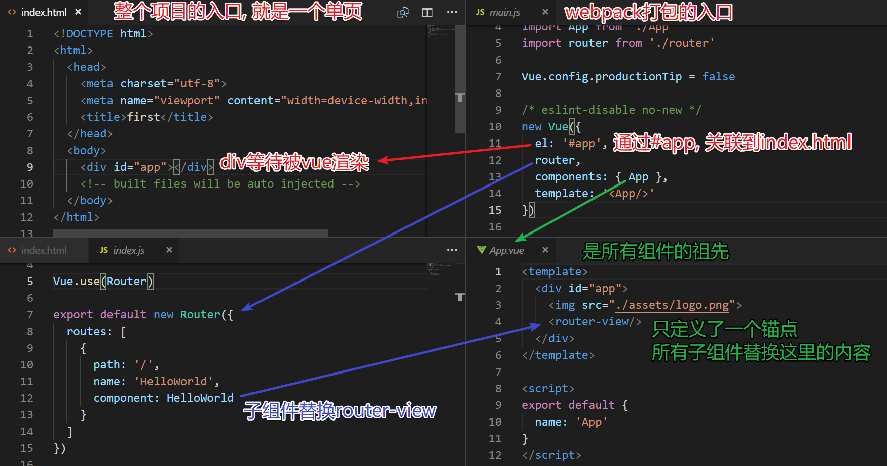

index.html: 项目唯一的html, 也是整个单页应用(SPA)的入口

​	在index.html中只定义了一个div, id=app, 等待被vue渲染

main.js: webpack打包的入口

​	定义一个vue对象(Root)

​	一个router, router从router/index.js导入, 使用vue-router进行组件导航

​	挂载了一个子组件:  App, App从App.vue导入

App.vue: 是所有子组件的祖先

​	定义一个锚点

当我们访问某一个path时, vue-router会把HelloWorld组件替换App.vue中定义的锚点

要编写的步骤

1. 规划路由
2. 编写组件

## 7.4.创建自定义路由

### 7.4.1. 规划路由规则

在src/router/index.js中, 添加一条路由规则, 如下

 

### 7.4.2. 定义组件

一般地, 为了项目的规范化, compents目录存放公共的组件, 新创建一个views目录存放业务相关组件, 在views下根据模块创建不同的文件夹.

1) 在src下创建views目录

2) 在views目录下创建users目录

3) 在users目录下创建Userlst.vue(用户列表组件)

 

### 7.4.3. 导入Userlst组件

 

在index.js中使用”import from”语法导入Userlst组件

示例代码:

```
import Userlst from '@/views/users/Userlst'
```

说明:

- Userlst : 表示一个对象, 可以在下面的代码中使用
- @: 表示src的绝对路径
- Userlst: 表示Userlst.vue一般不加后缀

### 7.4.4. 测试

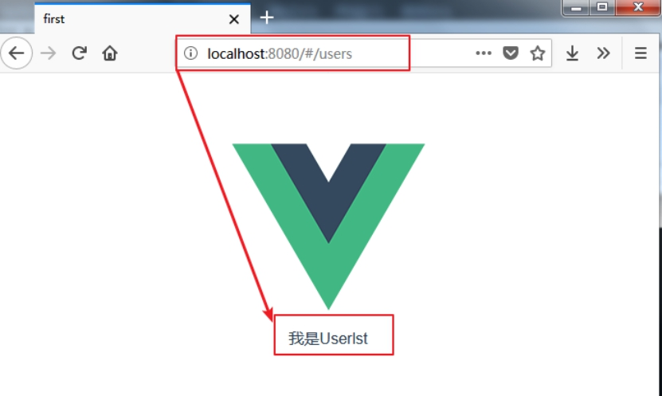 

### 补充: 导入的另一种写法

使用一个匿名函数, 返回导入的对象

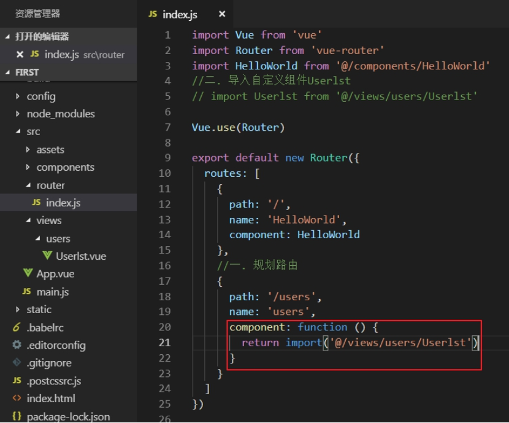 

使用ES6的语法, 进一步简化为:

 

# 8.Vuetify初步

Vue负责的是虽然会帮我们进行视图的渲染，但是样式是有我们自己来完成。这显然不是我们的强项，因此后端开发人员一般都喜欢使用一些现成的UI组件，拿来即用，常见的例如：

- BootStrap
- LayUI
- EasyUI
- ZUI

然而这些UI组件的基因天生与Vue不合，因为他们更多的是利用DOM操作，借助于jQuery实现，而不是MVVM的思想。

而目前与Vue吻合的UI框架也非常的多，国内比较知名的如：

- element-ui：饿了么出品
- i-view：某公司出品

然而我们都不用，我们今天推荐的是一款国外的框架：Vuetify

官方网站：https://vuetifyjs.com/zh-Hans/


## 8.1.为什么是Vuetify

有中国的为什么还要用外国的？原因如下：

- Vuetify几乎不需要任何CSS代码，而element-ui许多布局样式需要我们来编写
- Vuetify从底层构建起来的语义化组件。简单易学，容易记住。
- Vuetify基于Material Design（谷歌推出的多平台设计规范），更加美观，动画效果酷炫，且风格统一

这是官网的说明：


缺陷：

- 目前官网虽然有中文文档，但因为翻译问题，几乎不太能看。

## 8.2 Vuetify的安装

按照官网的介绍, 使用npm安装


在项目中, 使用ctrl+`, 打开命令行, 运行

```
npm i vuetify -S
```

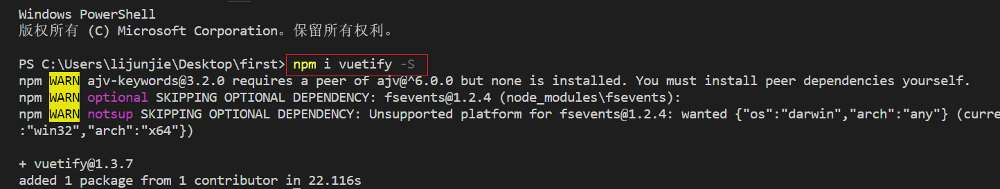

出现这个界面表明安装成功

## 8.3 Vuetify的引用

按照官网的说明, Vuetify的引用分为两个步骤

- 导入vuetify包
- 导入css文件


在项目入口文件main.js中编写如下代码

```vue
import Vuetify from 'vuetify'
Vue.use(Vuetify)

import 'vuetify/dist/vuetify.min.css'
```

## 8.4 测试

在官网中找到btn(按钮), 在页面中测试使用

https://vuetifyjs.com/en/components/buttons#introduction


找到自定义组件Userlst.vue, 编写模板内容

```vue
<template>
  <div>
    <v-btn color="success">成功</v-btn>
  </div>
</template>
```

我们发现, 出现了一个按钮, 但是颜色好像不对


原因是什么呢?

在官网中有介绍, 需要使用`<v-app>`标签

```vue
<template>
  <v-app>
    <v-btn color="success">成功</v-btn>
  </v-app>
</template>
```


颜色变正常了, 依然有些小瑕疵, 大小是一整行. 不过没关系, 至少证明咱们的vuetify生效了. 后面再来解决这个问题

#  9.Vuetify中的栅格系统

不管学习什么UI框架, 第一个需要了解的就是布局, 要实现布局就离不开栅格系统

查看一下官网的定义: https://vuetifyjs.com/zh-Hans/layout/grid


在Vuetify中, 是一个12点栅格, 主要有3个标签

- `<v-container>`: 表示一个容器
- `<v-layout>`: 表示一行
- `<v-flex>`: 表示一列

## 9.1 单行单列布局

### 9.1.1.规划路由

编写router/index.js. 添加一条路由规则

```vue
// Vuetify布局-栅格系统
{
    path: '/vuetify/grid',
    name: 'grid',
    component: () => import('@/views/vuetify/grid')
}
```

- path: 在浏览器地址栏中输入的路径
- component: 对应的组件, views/vuetify/grid.vue

### 9.1.2.创建一个组件

在views目录下创建vuetify目录, 再创建grid.vue文件


### 9.1.3.编写模板内容

```vue
<template>
  <div>
    <!-- v-container: 布局容器 -->
    <v-container>
      <!-- v-layout: 行元素 -->
      <v-layout>
        <!-- v-flex: 列元素 -->
        <v-flex>
          <!-- v-card: 卡片元素, 用来展示内容 -->
          <v-card color="red">第一行 第一列</v-card>
        </v-flex>
      </v-layout>
    </v-container>
  </div>
</template>
```

其中, 使用到了`<v-card>`, 主要用来展示内容. 咱们可以给一个红色

### 9.1.4.测试

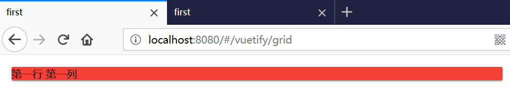

## 9.2 多行多列布局

### 9.2.1.备份grid

复制grid.vue, 改名grid1.vue

### 9.2.2.编写模板内容

```vue
<template>
  <div>
    <!-- v-container: 布局容器 -->
    <v-container>
      <!-- v-layout: 行元素 -->
      <v-layout>
        <!-- v-flex: 列元素 -->
        <v-flex>
          <!-- v-card: 卡片元素, 用来展示内容 -->
          <v-card color="red">第一行 第一列</v-card>
        </v-flex>
        <v-flex>
          <v-card color="blue">第一行 第二列</v-card>
        </v-flex>
      </v-layout>
      <v-layout>
        <v-flex>
          <v-card color="red">第二行 第一列</v-card>
        </v-flex>
        <v-flex>
          <v-card color="blue">第二行 第二列</v-card>
        </v-flex>
      </v-layout>
    </v-container>
  </div>
</template>
```

### 9.2.3. 测试


## 9.3 container属性

### 9.3.1.备份grid

复制grid.vue, 改名grid2.vue

### 9.3.2.间距属性

grid-list属性: 取值范围从xs 到 xl. xs表示极小 sm表示小 md表示中 lg表示大 xl表示极大


测试如下


### 9.3.3.字体对齐

text-xs-center: 文字居中对齐

测试如下:


## 9.4 响应式布局

响应式布局主要是用来控制在不同的设备中的显示状态, 通过`<v-flex>`的属性来调整, 跟bootstrap是一样的

看这样一段代码

```vue
<v-flex xs3 sm6 md9>
    <v-card color="red">第一行 第一列</v-card>
</v-flex>
<v-flex xs9 sm6 md3>
    <v-card color="blue">第一行 第二列</v-card>
</v-flex>
```

在<600的时候, 第一列占3份, 第二列占9份


在600~960之间时, 第一列占6份, 第二列占6份


在>960时, 第一列占9份, 第二列占3份


## 9.5 layout属性

layout的属性可以用来控制flex元素的对齐方式, 水平居中,垂直居中...

咱们来看这样一段代码

```vue
<v-layout wrap justify-center>
    <v-flex xs3>
        <v-card color="red">第二行 第一列</v-card>
    </v-flex>
    <v-flex xs10>
        <v-card color="blue">第二行 第二列</v-card>
    </v-flex>
</v-layout>
```

- wrap: 当超过12格时, 是否换行显示. wrap表示换行, 不加wrap(默认值)表示不换行
- justify-center: 水平居中

效果如下:

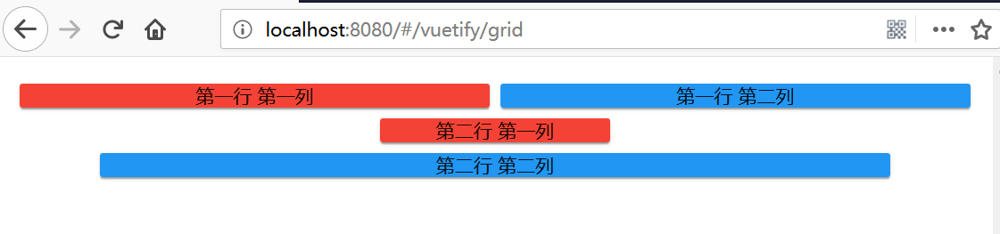

# 10.列表显示

## 10.1 需求分析

实现一个用户列表功能

1. 以表格的形式展现

2. 在操作部分有”编辑”和”删除”的入口

## 10.2 具体实现

### 10.2.1.Vuetify中的表格

https://vuetifyjs.com/zh-Hans/components/data-tables


基本标签`<v-data-table>`

分析下面这段代码

```vue
<template>
  <v-data-table
    :headers="headers"
    :items="desserts"
    hide-actions
    class="elevation-1"
  >
    <template slot="items" slot-scope="props">
      <td>{{ props.item.name }}</td>
      <td class="text-xs-right">{{ props.item.calories }}</td>
      <td class="text-xs-right">{{ props.item.fat }}</td>
      <td class="text-xs-right">{{ props.item.carbs }}</td>
      <td class="text-xs-right">{{ props.item.protein }}</td>
      <td class="text-xs-right">{{ props.item.iron }}</td>
    </template>
  </v-data-table>
</template>
```

data-table的属性

- headers加: 表示绑定了headers属性(代表表头信息)
- items加: 表示绑定了desserts属性(代表数据源)
- hide-actions: 表示不使用分页
- class="elevation-1" 显示层级, 直观上看就是阴影效果

template: 这是一个插槽, 用来渲染每一行数据

咱们可以先仿照着写一下

html部分

```vue
<template>
  <v-app>
    <v-data-table
      :headers="headers"
      :items="users"
      hide-actions
      class="elevation-1"
    >

    </v-data-table>
  </v-app>
</template>
```

由于这里需要绑定数据, 所以需要在属性中先定义

js部分

```js
export default {
    // 定义数据
    data() {
        return {
            headers:[],
            users:[]
        }
    }
}
```

效果:


### 10.2.2.制作表头

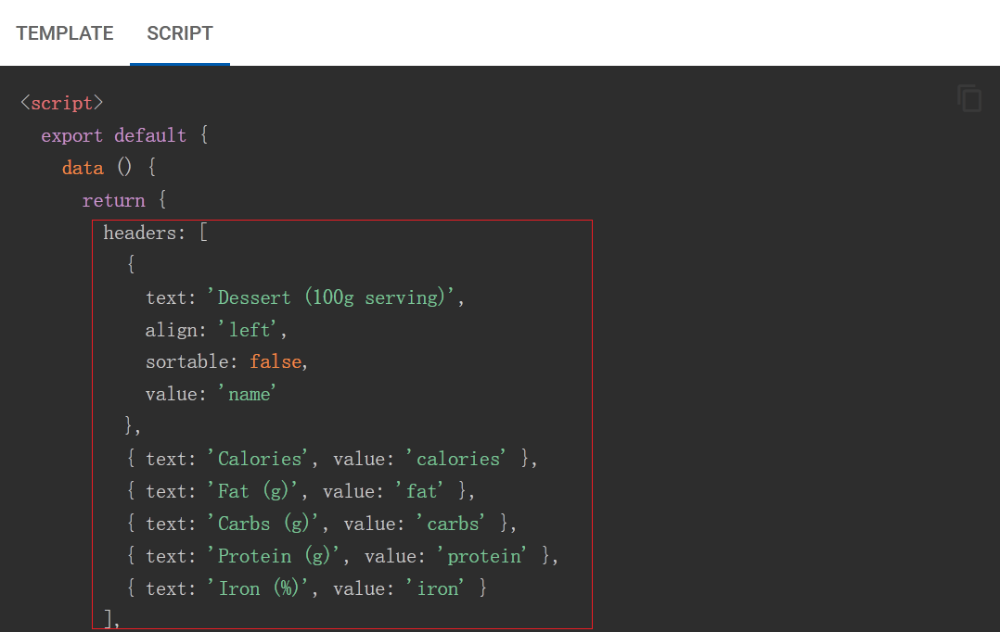

分析上面的代码,

一个对象就是表中的一列

```json
{
    text: 'Dessert (100g serving)',
    align: 'left',
    sortable: false,
    value: 'name'
}
```

- text: 显示的文本信息
- align: 对齐方式
- sortable: 是否可以排序
- value: 对应的字段

尝试一下

```json
{
    text: 'id',
    sortable: true,
    value: 'id'
}
```

id出现了, 但是这里出现了一个arrow_upward, 而页面中应该是一个箭头

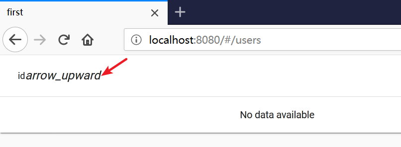

咱们先把其它的表头写了, 等下来解决这个问题

```js
headers:[
    {
        text: 'id',
        sortable: true,
        value: 'id'
    },
    {
        text: '姓名',
        value: 'name',
    },
    {
        text: '年龄',
        value: 'age'
    },
    {
        text: '操作',
        sortable: false
    }
],
```

测试效果:

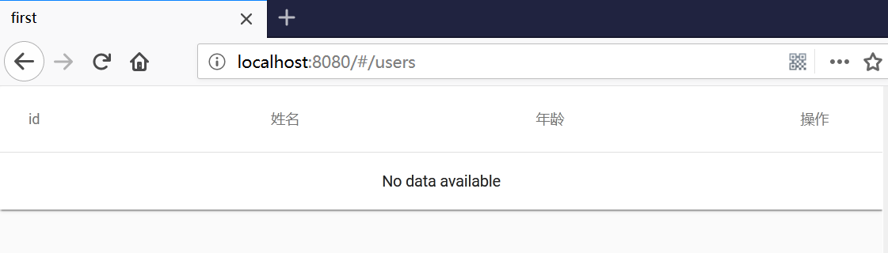

### 10.2.3.解决小箭头的问题

查看元素, 发现这个

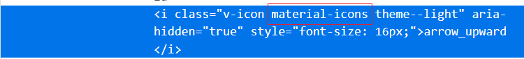

这个material-icons是一些字体文件, 需要安装一下

参考文档:

https://vuetifyjs.com/zh-Hans/framework/icons


首先安装, 然后导入

执行命令

```
npm install material-design-icons-iconfont -D
```

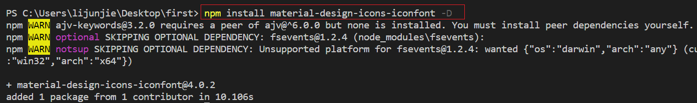

在main.js中导入

```
import 'material-design-icons-iconfont/dist/material-design-icons.css'
```

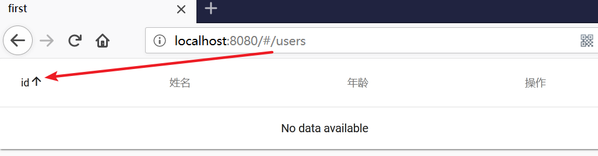

正常显示了

### 10.2.4.模拟数据

首先在data里模拟一些数据

```js
users:[
    {
        id: '1',
        name: '鸣人',
        age: 12
    },
    {
        id: '2',
        name: '佐助',
        age: 11
    }
]
```

然后在html中, 使用template标签渲染

```vue
<template slot="items" slot-scope="props">
    <td>{{props.item.id}}</td>
    <td>{{props.item.name}}</td>
    <td>{{props.item.age}}</td>
</template>
```

测试如下


### 10.2.5.制作操作按钮

查找文档

可以找到icon, 这些图标都是符合google的Material设计的, 

https://material.io/tools/icons/?style=baseline 这个网址打开的非常慢, 这里我直接告诉大家了

``` 
<v-icon small>edit</v-icon>
<v-icon small>delete</v-icon>
```

- small表示小号
- edit对应小铅笔图标
- delete对应垃圾桶

测试效果

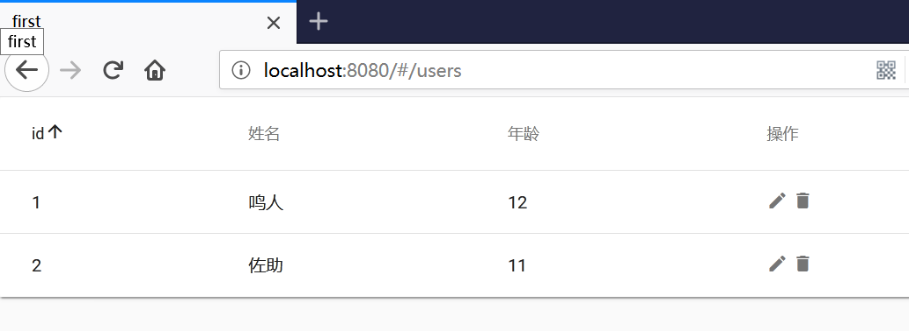

### 10.2.6.通过axios请求数据

安装axios

执行命令

```
npm install axios --save
```

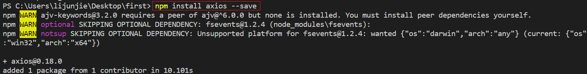

导入axios

```
import axios from 'axios'
```

编写一个方法getData

```js 
// 定义方法
methods: {
    getData() {
        // 通过axios发送请求
        axios.get('http://localhost:3000/users').then(resp => {
        // 解构resp
        const {status, data} = resp
        // console.log(data)
        // 将data保存到users中
        this.users = data
        })
    }
},
```

使用生命周期函数created()初始化数据

```js
created() {
    this.getData()
}
```

测试结果

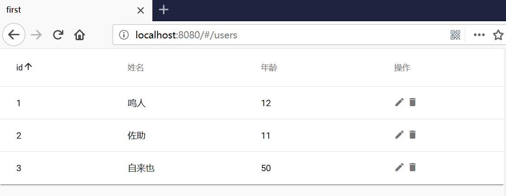

### 10.2.7.优化

使用layout布局使表格居中

```vue
<v-layout justify-center>
      <v-flex xs10>
        表格
      </v-flex>
</v-layout>
```

# 11.添加用户

## 11.1 需求分析

设计一个添加用户的按钮

当点击按钮时, 出现添加用户的表单

填写相应的数据, 调用接口, 保存到服务器

## 11.2 Vuetify中toolbar

https://vuetifyjs.com/zh-Hans/components/toolbars


分析如下代码

```vue
<template>
  <v-toolbar>
    <v-toolbar-side-icon></v-toolbar-side-icon>
    <v-toolbar-title>Title</v-toolbar-title>
    <v-spacer></v-spacer>
    <v-toolbar-items class="hidden-sm-and-down">
      <v-btn flat>Link One</v-btn>
      <v-btn flat>Link Two</v-btn>
      <v-btn flat>Link Three</v-btn>
    </v-toolbar-items>
  </v-toolbar>
</template>
```

- `<v-toolbar-side-icon>`是工具栏图标
- `<v-toolbar-title>`是标题
- `<v-toolbar-items>`是内容

尝试一下

```vue
<v-toolbar>
    <v-toolbar-title>用户列表</v-toolbar-title>
    <v-toolbar-items>
        <v-btn>添加用户</v-btn>
    </v-toolbar-items>
</v-toolbar>
```

测试效果

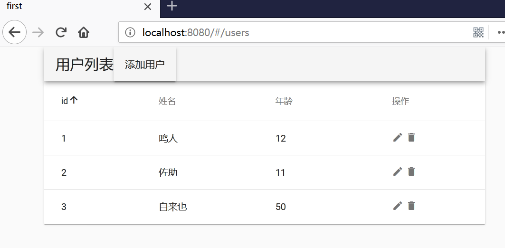	

进一步优化

```html
<v-toolbar dark color="primary">
```

- color: 颜色, primary就是主要的颜色
- dark: 主题, 黑色主题的字是白色的

```html
<v-spacer></v-spacer>
```

使用占位符来对齐

```html
<v-btn flat>添加用户</v-btn>
```

在按钮上加上flat, 去掉背景, 效果如下:


## 11.3 按钮点击事件


在按钮中有一个to属性, 可以直接指定一个router-link

```html
<v-btn flat to='/users/add'>添加用户</v-btn>
```

## 11.4 规划路由

在router/index.js中规划一个路由

```js
{
    path: '/users/add',
    name: 'addUser',
    component: () => import('@/views/users/UserAdd')
},
```

## 11.5 创建UserAdd组件

在views/users下创建UserAdd组件


## 11.6 编写模板

### 11.6.1.制作表单

这里, 我们需要使用Vuetify中的表单

https://vuetifyjs.com/zh-Hans/components/forms


分析代码:

- `<v-form>`: 表示一个表单
- `<v-text-field>`: 表示一个输入框

```html
<v-form>
    <v-text-field label="姓名"></v-text-field>
    <v-text-field label="年龄"></v-text-field>
</v-form>
```

label: 表示输入框的文本

测试

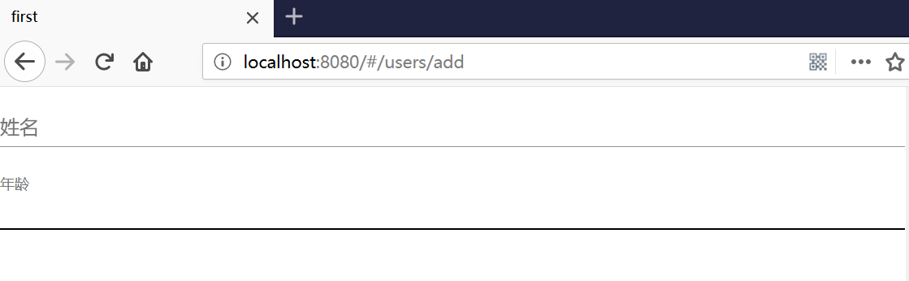

这样子看起来不怎么好看, 咱们优化一下

### 11.6.2.使用v-card卡片

https://vuetifyjs.com/zh-Hans/components/cards

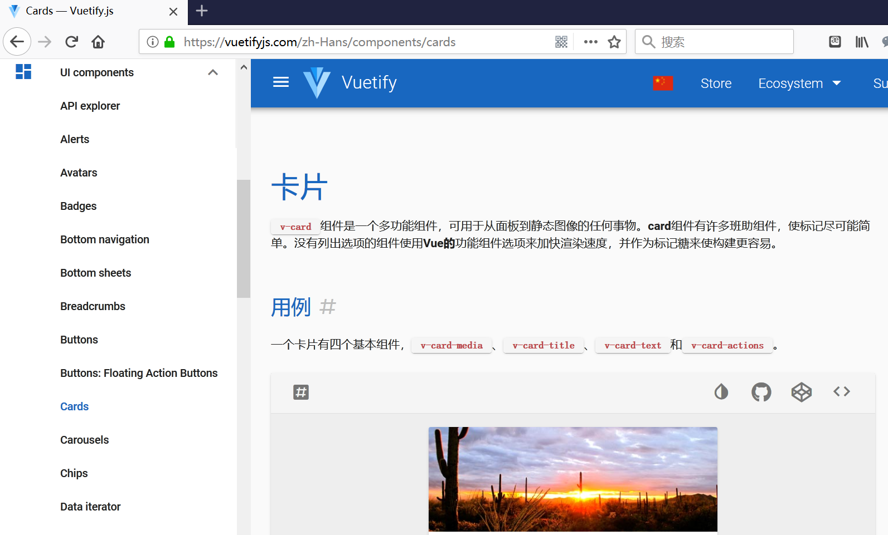

主要是3个基本组件

- `v-card-title`: 标题
- `v-card-text`: 内容
- `v-card-actions`: 操作

```html
<v-card>
    <v-card-title>添加用户</v-card-title>
    <v-card-text>
    	表单
    </v-card-text>
    <v-card-actions></v-card-actions>
</v-card>
```

进一步调整

```html
<v-card>
    <v-card-title class="elevation-1 title">添加用户</v-card-title>
    <v-card-text>
        <v-form>
            <v-text-field label="姓名"></v-text-field>
            <v-text-field label="年龄"></v-text-field>
        </v-form>
    </v-card-text>
    <v-card-actions>

    </v-card-actions>
</v-card>
```

- elevation-1 : 在标题加上一些阴影
- title: 设置字体大小

加入两个按钮

```html
<v-card-actions>
    <v-spacer></v-spacer>
    <v-btn flat color="primary">添加</v-btn>
    <v-btn flat color="primary">返回</v-btn>
</v-card-actions>
```

### 11.6.3.使用布局

实现居中对齐

```html
<v-layout justify-center>
      <v-flex xs6>
      </v-flex>
</v-layout> 
```

测试效果


## 11.7 绑定数据与事件

### 11.7.1.给输入框绑定数据

在js中定义属性

```js
data() {
    return {
        user: {
            name: '',
            age: ''
        }
    }
},
```

在html中绑定

```html
<v-text-field label="姓名" v-model="user.name"></v-text-field>
<v-text-field label="年龄" v-model="user.age"></v-text-field>
```

### 11.7.2.给添加按钮绑定事件

在html中绑定add方法

```html
<v-btn flat color="primary" @click="add">添加</v-btn>
```

在js中编写add方法

```js
methods: {
    add() {
		// 发送请求
    }
}
```

导入axios

```js
import axios from 'axios'
```

发送请求

```js
add() {
    axios.post('http://localhost:3000/users', this.user).then(resp => {
        const {status, data} = resp

        if (status == 201) {
            alert("添加成功")
            this.$router.push('/users')
        }
    })
}
```

### 11.7.3.给返回按钮绑定事件

```html
<v-btn flat color="primary" to="/users">返回</v-btn>
```

# 12.修改用户

## 12.1 需求分析

当点击修改按钮时, 出现修改用户的表单

填写相应的数据, 调用接口, 保存到服务器

## 12.2 入口链接

给edit绑定一个事件

```html
<v-icon small @click="edit(props.item.id)">edit</v-icon>
```

在methods中定义对应的方法

```js
edit(id) {
    this.$router.push('/users/edit/'+id)
}
```

## 12.3 规划路由并创建组件

在router/index.js路由中添加一个路由规则

```js
{
      path: '/users/edit/:id',
      name: 'editUser',
      component: () => import('@/views/users/UserEdit')
},
```

在views/users下创建UserEdit.vue

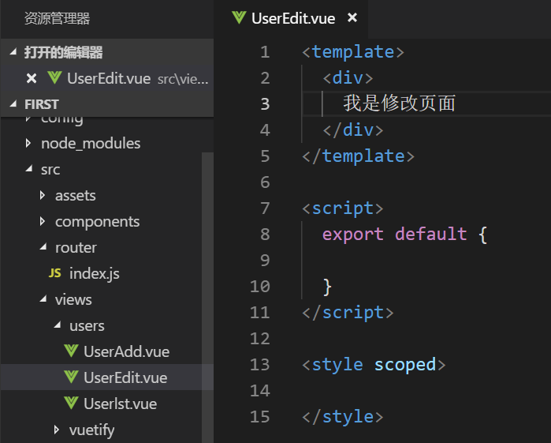

## 12.4 编写模板

由于跟添加页面的模板大致相同, 所以咱们复制过来, 稍微修改一下

```html
<template>
  <v-app>
    <v-layout justify-center>
      <v-flex xs6>
        <v-card>
          <v-card-title class="elevation-1 title">修改用户</v-card-title>
          <v-card-text>
            <v-form>
              <v-text-field label="姓名" v-model="user.name"></v-text-field>
              <v-text-field label="年龄" v-model="user.age"></v-text-field>
            </v-form>
          </v-card-text>
          <v-card-actions>
            <v-spacer></v-spacer>
            <v-btn flat color="primary" @click="edit">修改</v-btn>
            <v-btn flat color="primary" to="/users">返回</v-btn>
          </v-card-actions>
        </v-card>
      </v-flex>
    </v-layout>
  </v-app>
</template>
```

js部分:

```js
data() {
      return {
        user: {
          name: '',
          age: ''
        }
      }
    },
    methods: {
      edit() {
        
      }
    }
  }
```

## 12.5 数据回显

使用生命周期函数created, 请求数据接口, 获取数据

1) 如果要请求数据, 需要使用axios, 首先导入axios

```html
import axios from 'axios'
```

2) 请求数据

```js
created() {
    // 1. 获取路由参数中id的值
    this.id = this.$route.params.id
    // 2. 请求接口
    axios.get('http://localhost:3000/users/'+this.id).then(resp => {
        const {status, data} = resp
        if (status == 200) {
            this.user = data
        }
    })
}
```

## 12.6 修改保存数据

使用put的方式请求接口, 并携带用户参数, 处理返回结果

```js
edit() {
    axios.put('http://localhost:3000/users/'+this.id, this.user).then(resp => {
        const {status, data} = resp
        if (status == 200) {
            alert('修改成功')
            this.$router.push('/users')
        }
    })
}
```

# 13. 删除用户

## 13.1 需求分析

当点击删除按钮时, 出现是否确认删除的对话框

如果确认删除, 就请求接口, 删除数据

## 13.2 绑定删除事件

给删除按钮绑定删除事件

```html
<v-icon small @click="del(props.item.id)">delete</v-icon>
```

编写del方法

```js
del(id) {
    if (confirm('确认删除?')) {
        axios.delete('http://localhost:3000/users/'+id).then(resp => {
            const {status, data} = resp
            if (status == 200) {
                alert('删除成功')
                this.$router.push('/users')
            }
        })
    }
}
```


